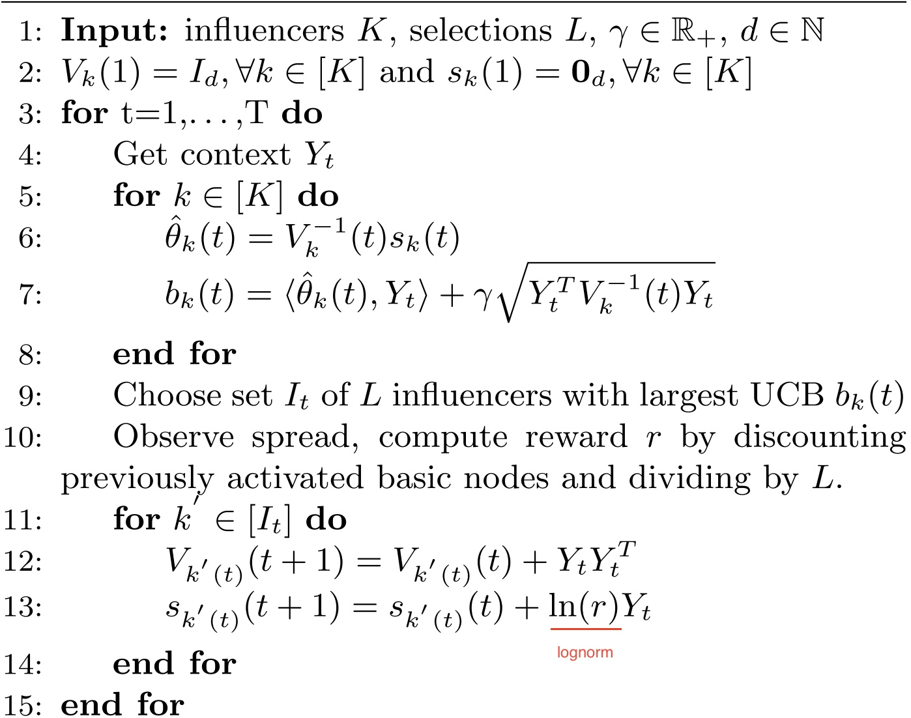

# bandit

There are two tasks in this project

## bandit for influence maximization, based on Twitter dataset

The implementation is based on the influence maximization model from [Contextual Bandits for Advertising Campaigns](https://arxiv.org/pdf/2201.05231.pdf)

Note: this is not a strict LinUCB method, since the theta estimator is updated for each arm.

Files description
---
- data_preprocessing (preprocess of Twitter data for Influence Maximization)
    - 1_get_contexts.py: usging twi-glove semantic data to gendrate the controids of clustering
    - 2_get_top_influencers.sh
    - 3_get_influencer_retweets.sh get the related tweets from the selected top influencers
    - 4_create_encoded_retweets.py add the context vector to orignal tweets
    - 5_sort_by_date.py to arrange them for IM process
    - 6_count_activations.py get the influenced nodes number
      
- model
    - bandit_im.py bandit for IM problem, some hyperparameters to be discussed

## bandit for news recommendation, based on Yahoo dataset
- dataset.py 
    - preprocess of Yahoo data for news recommendation
    - example of data format Line format for yahoo events:
1241160900 109513 0 |user 2:0.000012 3:0.000000 4:0.000006 5:0.000023 6:0.999958 1:1.000000 |109498 2:0.306008 3:0.000450 4:0.077048 5:0.230439 6:0.386055 1:1.000000 |109509 2:0.306008 3:0.000450 4:0.077048 5:0.230439 6:0.386055 1:1.000000 [[...more article features omitted...]] |109453 2:0.421669 3:0.000011 4:0.010902 5:0.309585 6:0.257833 1:1.000000

- bandits.py
    - bandit for news recommendation